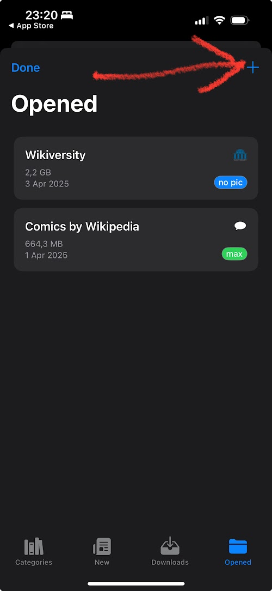
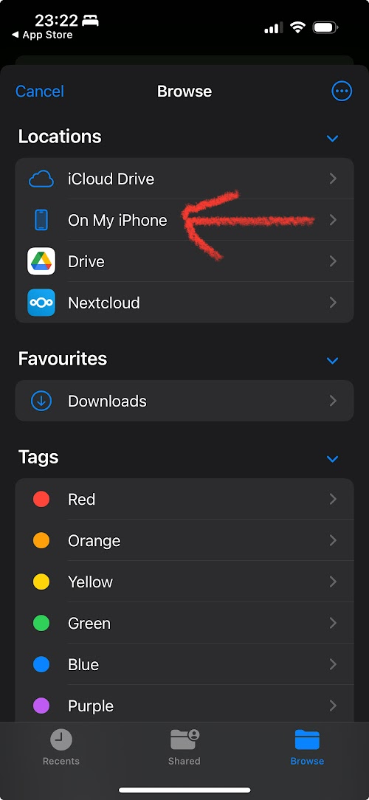
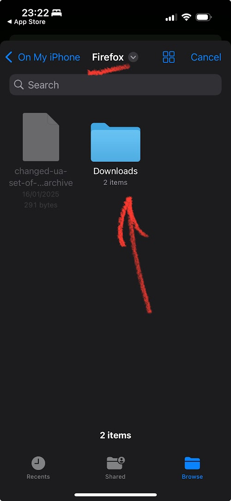
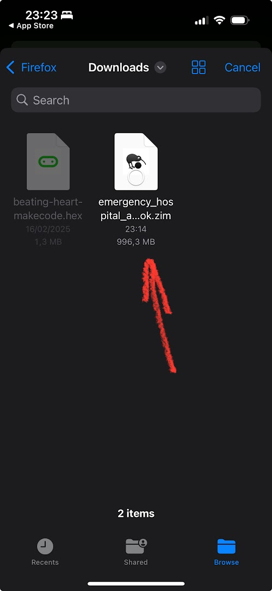
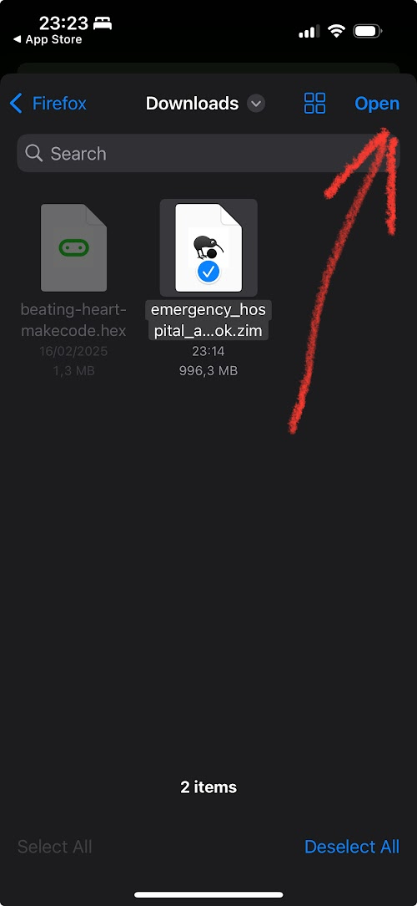
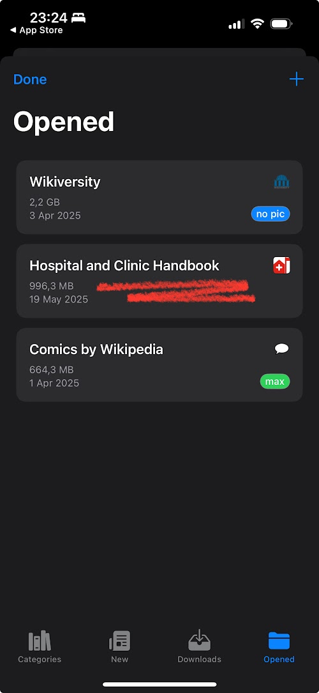
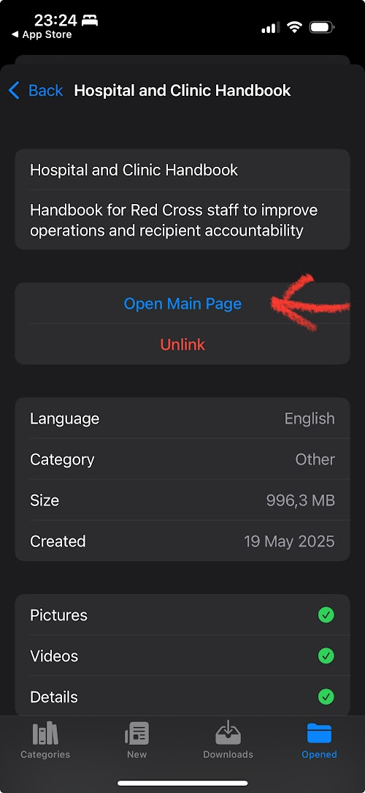
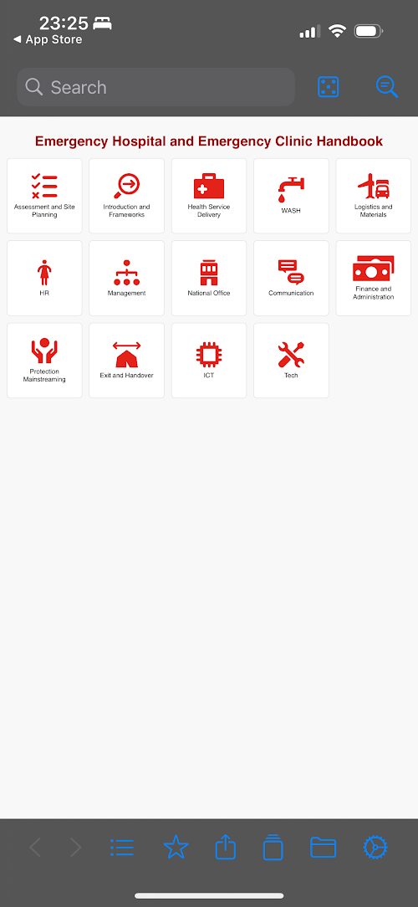
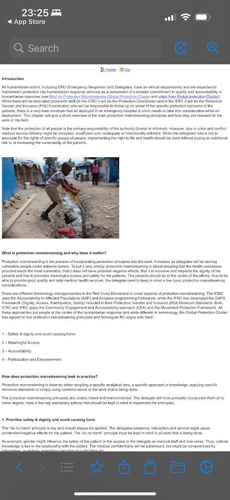

# Emergency Hospital and Emergency Clinic Handbook - Offline access via Kiwix

This repository holds a compressed version of the Emergency handbook created by the Norwegian Red Cross, made for offline access or slow-internet connections, using [Kiwix](https://kiwix.org/en/applications/).

This handbook is [available on internet](https://rodekors.service-now.com/drm?id=hb_catalog&handbook=e3cabf24db361810d40e16f35b9619c7).

## 1. Install Kiwix

Install Kiwix on your laptop or on your mobile phone from this page: 
https://kiwix.org/en/applications/

## 2. Download the handbook

The handbook is quite large, about 950 MBytes. Make sure your laptop or smartphone has enough available storage.

Download the handbook by clicking on [this url](https://github.com/norwegianredcross/Emergency-Hospital-and-Emergency-Clinic-Handbook/raw/refs/heads/main/emergency_hospital_and_emergency_clinic_handbook.zim?download=) 👈

## 3. Open the hanbook in Kiwix

1. Add another Kiwix collection

Follow the steps shown in the following screenshots:

